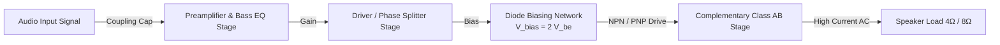

# P10: Class AB / Ultra Bass Amplifier


## Executive Overview
High-fidelity audio reproduction requires a delicate balance between power efficiency and signal distortion. This project covers the theoretical design and schematic validation of a **Class AB Push-Pull Audio Amplifier** engineered for ultra-bass reinforcement. By combining the low-distortion characteristics of Class A amplifiers with the high-efficiency performance of Class B topologies, this design eliminates crossover distortion while delivering substantial transient power to low-impedance acoustic loads.

> [!WARNING]
> **Thermal Safety & Acoustic Load Callout**
> Bipolar Junction Transistors (BJTs) are highly susceptible to **Thermal Runaway** due to their negative temperature coefficient ($V_{BE}$ drops as temperature rises). Failing to correctly size the heatsinks or correctly bias the complementary output stage can lead to catastrophic silicon failure. Furthermore, driving an incorrect load impedance (e.g., $2\Omega$ instead of $4\Omega/8\Omega$) will exceed the transistors' safe operating area (SOA). Output DC-blocking capacitors must be carefully rated to prevent DC offset voltages from melting speaker voice coils.

## System Highlights
- **Complementary Symmetry Output Stage**: Utilizes a matched NPN/PNP transistor pair to handle alternating half-cycles, greatly increasing conversion efficiency over pure Class A architectures.
- **Diode-Biasing Network**: Eliminates harmonic crossover distortion by maintaining a forward-bias voltage equal to the $2 \times V_{BE}$ drops of the output transistors, ensuring a seamless handover near the zero-crossing.
- **Emitter Degeneration ($R_E$)**: Introduces localized negative feedback to prevent thermal runaway and stabilize the quiescent current ($I_Q$).
- **Frequency Filtering (Bass Reinforcement)**: Incorporates passive RC networks specifically tuned to amplify sub-woofer low-frequency bandwidths while attenuating treble.

## System Architecture Diagram



## Theoretical & Mathematical Models

### 1. Diode Biasing & Crossover Elimination
To keep the output transistors precisely on the threshold of conduction (Class AB), the biasing voltage $V_{BB}$ provided by the diode string must equal the sum of the base-emitter drops of the push-pull pair:
$$V_{BB} = V_{D1} + V_{D2} \approx V_{BE,Q1} + |V_{BE,Q2}|$$

### 2. Maximum Output Power
Assuming ideal transistor saturation ($V_{CE,sat} \approx 0\text{V}$), the maximum continuous sinusoidal RMS power delivered to the speaker ($R_L$) is:
$$P_{out(max)} = \frac{V_{peak}^2}{2 R_L} = \frac{(V_{CC} - V_{CE,sat})^2}{2 R_L}$$

### 3. Maximum Theoretical Conversion Efficiency
Class AB push-pull amplifiers can achieve highly efficient DC-to-AC conversion, theoretically approaching:
$$\eta_{max} = \frac{\pi}{4} \cdot \frac{V_{peak}}{V_{CC}} \approx 78.54\%$$

### 4. Maximum Transistor Thermal Dissipation
The maximum power dissipated by the transistors as heat occurs when the peak output voltage reaches $V_{peak} = \frac{2}{\pi} V_{CC}$:
$$P_{D,max(total)} = \frac{2 V_{CC}^2}{\pi^2 R_L}$$

### 5. Emitter Degeneration & Thermal Stability
Thermal runaway is mitigated by placing small power resistors ($R_E \approx 0.22\Omega$) at the transistor emitters. The stabilizing feedback loop operates as follows:
$$V_{BE} = V_{B} - I_E R_E \implies \Delta T \uparrow \implies I_C \uparrow \implies V_{RE} \uparrow \implies V_{BE} \downarrow \implies I_C \text{ stabilizes}$$

## Verified Bill of Materials (BOM)
| Component Type | Specification / Function |
| :--- | :--- |
| **Output Stage (NPN/PNP)** | High Power Complementary Pair (e.g., TIP41C/TIP42C or 2SD718/2SB688) |
| **Biasing Diodes** | 1N4148 or equivalent (thermally coupled to output heatsink) |
| **Emitter Resistors ($R_E$)** | $0.22\Omega$ to $0.47\Omega$ (5W Ceramic) |
| **Pre-amp Transistors** | Low-noise NPN (e.g., BC547 or 2N3904) |
| **Input/Output Coupling Caps** | $10\mu\text{F}$ Input / $1000\mu\text{F}$ to $2200\mu\text{F}$ Output DC Blocking |
| **Load Impedance ($R_L$)** | $4\Omega$ or $8\Omega$ Subwoofer |

## Repository Layout Tree
```text
.
├── _archive/              # Miscellaneous drafts and artifacts
├── docs/                  # Comprehensive engineering design reports (.docx, .pdf)
│   └── images/            # Original schematic screenshots and simulation waveform plots
└── README.md              # P01 Gold Standard Documentation
```

## Simulation & Design Analysis
The operating quiescent current ($I_Q$) is carefully calibrated via the biasing network to sit just slightly above cut-off (Class AB classification). This small standing current eliminates the dead zone (crossover distortion) typically found in pure Class B amplifiers, drastically lowering Total Harmonic Distortion (THD) at low listening volumes, while maintaining excellent transient efficiency during bass-heavy dynamic peaks.

## Authentic Evidence Catalog
- **Engineering Reports**: [`docs/حسن مقبل_علي السودي_ مشروع الكترونيات1.pdf`](docs/)
- **Design Schematics & Visual Evidence**: Located in [`docs/images/`](docs/images/) **[ORIGINAL DESIGN & SIMULATION ARTIFACTS]**.

## Engineering Defensibility & Limitations
- **Absence of Native CAD**: The original EDA simulation files (Multisim/Proteus) are missing from the digital archive. The project relies entirely on the recovered theoretical PDF reports and visual screenshots to establish engineering defensibility.
- **Topological Tradeoffs**: This specific topology lacks a global closed-loop Negative Feedback (NFB) network, meaning its Total Harmonic Distortion (THD) will be higher than modern operational-amplifier-driven topologies (like the LM3886). Additionally, utilizing a single-supply rail requires an output DC-coupling capacitor, which slightly impedes ultra-low frequency bass response compared to a dual-rail OCL (Output Capacitor-Less) design.

---

**Hassan Moqbel Morshed Ghaleb**
Mechatronics Engineer | Mechanical Design & CAD (SolidWorks & AutoCAD) | Preventive Maintenance & Electromechanical Systems | Industrial Automation, Control Systems, Robotics & Intelligent Machines | CAD/FEA, Embedded Systems, Python & C++
[GitHub](https://github.com/Hassan-Moqbel) · [Facebook](https://www.facebook.com/share/1BqxAgVjHi/) · [LinkedIn](https://www.linkedin.com/in/hassan-moqbel)

## License
This project is licensed under the [MIT License](LICENSE).
